# Plan de Implementación — Blog Personal
#### 1. 🌐 Internacionalización (i18n) — Activar el directorio existente

Existe el directorio [src/i18n/](file:///Users/andres/dev/blog/src/i18n) pero **no se usa actualmente**. El blog tiene audiencia hispanohablante (autor guatemalteco, timezone `America/Guatemala`) pero todo el contenido y la UI están en inglés.

**Feature propuesta:**
- Implementar un toggle de idioma (ES/EN) en el header
- Traducir la UI chrome (nav, footer, labels de secciones, breadcrumbs)
- Usar Astro's built-in i18n routing o un pattern de content collections por locale
- Empezar solo con los strings de UI, no los posts (los posts pueden tener un `lang` en frontmatter)

**Impacto:** SEO (hreflang tags), audiencia más amplia, ya tienes la carpeta lista

---

#### 2. 📱 PWA y Manifest — No existe

No hay `manifest.json` ni service worker. Para un blog con audio streaming y galerías, una PWA básica añade:
- Instalabilidad en móviles
- Caching offline de páginas visitadas (el search index de Pagefind podría persistir)
- Mejor puntuación en Lighthouse

**Feature propuesta:**
- Crear `public/manifest.json` con icons, theme_color, display standalone
- Añadir un service worker básico con [workbox-precaching](https://developer.chrome.com/docs/workbox/modules/workbox-precaching) para cachear assets estáticos
- Registrar el manifest en [Layout.astro](file:///Users/andres/dev/blog/src/layouts/Layout.astro)

---

#### 6. 🔧 CI/CD — No hay workflows de GitHub Actions

El directorio `.github/` tiene templates de issues y PR pero **ningún workflow**. No hay:
- Build validation en PRs
- Lighthouse CI
- Deploy preview automático

**Feature propuesta:**
- Workflow `ci.yml`: `pnpm install` → `astro check` → `astro build` en PRs
- Workflow `lighthouse.yml`: correr Lighthouse CI automáticamente y reportar scores
- Opcional: deploy preview a Vercel en cada PR

### 🟡 P2 — Impacto Medio / Mejora de Pulido

#### 16. 📐 Content-Visibility — Lazy Rendering de secciones largas

Las páginas de listado ([...page].astro, archives, tags) renderizan **todos los cards del viewport** inmediatamente. Para feeds con muchos posts:

**Feature propuesta:**
- Añadir `content-visibility: auto` con `contain-intrinsic-size` a los cards de lista
- Esto permite al browser skip rendering de cards fuera del viewport
- Zero JavaScript, pure CSS performance win

```css
.card-glow {
  content-visibility: auto;
  contain-intrinsic-size: 0 280px; /* estimated card height */
}
```

#### 19. 🖋️ Estimated Reading Position — "Continue where you left off"

Para posts largos, guardar la posición de lectura en `localStorage` y ofrecer un botón "Continue reading" cuando el usuario regresa.

**Feature propuesta:**
- Guardar scroll % + slug en localStorage al salir del post
- Al volver al mismo post, mostrar un toast/pill: "Continue from where you left off?"
- Auto-dismiss después de 5 segundos o al hacer scroll manualmente

---

### 🟢 P3 — Nice-to-Have / Diferenciadores

---

#### 20. 📊 Post Statistics Dashboard

Una página `/stats` que muestre:
- Total posts, total palabras, promedio de lectura
- Posts por mes (chart simple con CSS, sin librería)
- Tags más usados (ya existe en `/tags` pero sin chart)
- Racha de publicación

Esto es una feature "about the blog" que demuestra consistencia de publicación.

---

#### 21. 🌙 Reading Mode

Un toggle que simplifique la UI del post para lectura enfocada:
- Ocultar header, footer, sidebar, backdrop effects
- Ampliar el ancho del contenido
- Tipografía optimizada para lectura larga (line-height mayor, serif font option)
- Accesible via shortcut `r`

---

#### 22. ✨ Micro-Interactions Adicionales

| Interacción | Dónde | Descripción |
|:---|:---|:---|
| Typing animation | Hero description | Efecto typewriter en la descripción del hero |
| Page transition effects | Entre rutas | Custom view-transition animations (crossfade + slide) |
| Skeleton loading | Cards, search | Pulse/shimmer placeholders mientras carga contenido |
| Easter egg | Konami code | Trigger efecto especial (matrix rain, confetti, theme secreto) |
| Haptic feedback | Audio player mobile | `navigator.vibrate()` al interactuar en mobile |

---

#### 23. 📝 Changelog / What's New

Para un blog que itera constantemente sobre su diseño, una sección `/changelog` con:
- Versión + fecha + descripción de cambios
- Screenshots antes/después
- Links a commits/PRs relevantes

---

#### 24. 🔗 Link Preview on Hover (Social Cards)

Cuando el usuario pasa el mouse sobre un link externo en un post, mostrar un tooltip con:
- Título de la página
- Descripción
- Favicon
- Screenshot miniatura (opcional, via API como microlink.io)

---

## Resumen de Prioridades

```mermaid
graph LR
    subgraph P0["🔴 P0 — Quick Wins"]
        A[i18n Activation]
        B[PWA/Manifest]
        C[Image Optimization]
        D[Progress Bar CSS]
    end
    subgraph P1["🟠 P1 — High Impact"]
        E[Sticky TOC]
        F[Giscus Comments]
        G[Analytics]
        H[Related Posts]
        I[Accent Color Picker]
    end
    subgraph P2["🟡 P2 — Polish"]
        J[Breadcrumb Schema]
        K[Keyboard Shortcuts]
        L[Copy URL]
        M[content-visibility]
        N[Scroll Animations]
        O[Reading Position]
    end
    subgraph P3["🟢 P3 — Differentiators"]
        P[Stats Dashboard]
        Q[Reading Mode]
        R[Micro-Interactions]
        S[Changelog]
        T[Link Preview]
    end
    P0 --> P1 --> P2 --> P3
```



## User Review Required

> [!IMPORTANT]
> **¿Cuáles features te interesan implementar?** Este análisis cubre 20 features. Selecciona las que quieras priorizar y puedo crear un plan de implementación detallado para cada una con archivos específicos a modificar, componentes nuevos, y estimación de esfuerzo.

## Open Questions

> [!NOTE]
> 1. **¿Quieres que el blog soporte contenido bilingüe (posts en ES y EN)?** — o solo la UI chrome?
> 2. **¿Tienes cuenta en algún analytics service?** (Plausible, Umami, Vercel Analytics)
> 3. **¿El repositorio tiene GitHub Discussions activado?** — necesario para Giscus
> 4. **¿Prefieres cambios incrementales (PR por feature) o un batch grande?**
