# 🔬 Análisis de Features para Mejorar Devosfera

Análisis exhaustivo del blog [Astro Devosfera](https://devosfera.vercel.app/) basado en la revisión completa del código fuente: componentes, layouts, estilos, configuración, sitio en producción, y patrones de rendimiento.

---

## Estado Actual — Lo que ya está bien hecho ✅

Antes de las sugerencias, vale la pena reconocer que el blog ya tiene una base **sólida y por encima del promedio**:

| Área | Fortalezas actuales |
|:---|:---|
| **Diseño** | Glassmorphism, aurora orbs, cursor glow, grain noise, shimmer gradients — todo coherente con la estética cyberpunk/terminal |
| **SEO** | JSON-LD (WebSite, BlogPosting, ProfilePage), OG/Twitter meta, sitemap, RSS, canonical URLs, structured search action |
| **Tipografía** | 4 fuentes locales (Wotfard, Sriracha, Fira Code, Cascadia Code) con fallbacks generados por Astro |
| **Búsqueda** | Dual search: modal global ⌘K + página dedicada, ambas con Pagefind |
| **Accesibilidad** | Skip-to-content, aria-labels, `prefers-reduced-motion` fallbacks, focus-visible rings |
| **Rendimiento** | `prefetchAll: true`, View Transitions (ClientRouter), `contain: paint`, FOUC prevention, lazy loading, rAF batching, passive listeners, AbortController cleanup |
| **Galerías** | Sistema completo con lightbox `<dialog>`, GalleryEmbed para MDX, optimización de imágenes en build |
| **Audio** | Player terminal con estado compartido entre páginas via introAudioStore |

---

## Recomendaciones de Features — Organizadas por Prioridad

### 🔴 P0 — Alto Impacto / Esfuerzo Bajo

---

#### 1. 🌐 Internacionalización (i18n) — Activar el directorio existente

Existe el directorio [src/i18n/](file:///Users/andres/dev/blog/src/i18n) pero **no se usa actualmente**. El blog tiene audiencia hispanohablante (autor guatemalteco, timezone `America/Guatemala`) pero todo el contenido y la UI están en inglés.

**Feature propuesta:**
- Implementar un toggle de idioma (ES/EN) en el header
- Traducir la UI chrome (nav, footer, labels de secciones, breadcrumbs)
- Usar Astro's built-in i18n routing o un pattern de content collections por locale
- Empezar solo con los strings de UI, no los posts (los posts pueden tener un `lang` en frontmatter)

**Impacto:** SEO (hreflang tags), audiencia más amplia, ya tienes la carpeta lista

---

#### 2. 📱 PWA y Manifest — No existe

No hay `manifest.json` ni service worker. Para un blog con audio streaming y galerías, una PWA básica añade:
- Instalabilidad en móviles
- Caching offline de páginas visitadas (el search index de Pagefind podría persistir)
- Mejor puntuación en Lighthouse

**Feature propuesta:**
- Crear `public/manifest.json` con icons, theme_color, display standalone
- Añadir un service worker básico con [workbox-precaching](https://developer.chrome.com/docs/workbox/modules/workbox-precaching) para cachear assets estáticos
- Registrar el manifest en [Layout.astro](file:///Users/andres/dev/blog/src/layouts/Layout.astro)

---

#### 3. 🖼️ Imágenes de Cards — Usar `<Image>` de Astro en vez de `` nativo

En la [Card.astro](file:///Users/andres/dev/blog/src/components/Card.astro), las cover images usan `` nativo con URLs hardcoded al build output:

```html

```

Esto **no aprovecha** la optimización de imágenes de Astro (ya configurada en `astro.config.ts` con `layout: "constrained"` y `responsiveStyles: true`).

**Feature propuesta:**
- Refactorizar las cover images para usar `<Image>` de `astro:assets`
- Generar `srcset` con múltiples resoluciones + formato WebP/AVIF automático
- Reducir significativamente el peso de imágenes en la página de posts

---

#### 4. ⚡ Reading Progress Bar — Solo en PostDetails

En [PostDetails.astro](file:///Users/andres/dev/blog/src/layouts/PostDetails.astro) hay una barra de progreso de lectura, lo cual es genial. Pero se podría mejorar con:

**Feature propuesta:**
- Hacer la barra de lectura estilizada como la estética del blog (gradient accent, glow)
- Añadir **estimated read time progress** — no solo scroll position sino porcentaje real basado en palabras leídas
- Usar Scroll-Driven Animations (nativo CSS) en vez de JavaScript para mejor rendimiento

---

#### 5. 🍎 Favicon & Apple Touch Icon — Archivos sin vincular

Existen `apple-touch-icon.png` y `apple-touch-icon-precomposed.png` en `public/` pero **no están referenciados en `<head>`**. También falta un `.ico` fallback.

**Feature propuesta:**
- Añadir `<link rel="apple-touch-icon" href="/apple-touch-icon.png">` en [Layout.astro](file:///Users/andres/dev/blog/src/layouts/Layout.astro)
- Generar `favicon.ico` desde el SVG para compatibilidad con navegadores legacy
- 5 minutos de trabajo, impacto real en iOS y búsqueda

---

#### 6. 🔧 CI/CD — No hay workflows de GitHub Actions

El directorio `.github/` tiene templates de issues y PR pero **ningún workflow**. No hay:
- Build validation en PRs
- Lighthouse CI
- Deploy preview automático

**Feature propuesta:**
- Workflow `ci.yml`: `pnpm install` → `astro check` → `astro build` en PRs
- Workflow `lighthouse.yml`: correr Lighthouse CI automáticamente y reportar scores
- Opcional: deploy preview a Vercel en cada PR

---

#### 7. ⚠️ `will-change` Excesivo — 25+ instancias

Se detectaron 25+ usos de `will-change` across componentes. Muchos promueven elementos al compositor layer innecesariamente, aumentando uso de memoria GPU.

**Análisis Detallado:**
1. **Páginas de Lista (Archives, Tags, Search, Home)**: Contienen múltiples cards (`.post-card`, `.tag-card`, etc.). Cada una tiene elementos decorativos como auroras y brillos con `will-change: transform`. Si hay 30 a 50 posts/tags, se promueven hasta 100 capas del compositor de forma permanente, consumiendo memoria GPU innecesaria cuando están estáticas.
2. **Botones de Redes Sociales (Footer)**: Tienen `will-change: transform, box-shadow` de manera permanente para un simple efecto hover de desplazamiento. Es innecesario.
3. **Visor de Imágenes (Lightbox)**: Las imágenes estáticas del Lightbox tienen `will-change: transform` y `transform: translateZ(0)` pero no se animan mediante transformaciones (solo cambian su `.src`).
4. **Aurora/Mouse en Hero**: Tienen `will-change: transform` activa todo el tiempo, incluso cuando el mouse no está sobre el contenedor.

**Plan de Cambios Propuesto:**

* **`src/components/Card.astro`**
  - Mover `will-change: opacity` de `.card-glow-effect` a un estado dinámico: `.group/card:hover .card-glow-effect, .group/card:focus-within .card-glow-effect { will-change: opacity; }`.

* **`src/components/Footer.astro`**
  - Eliminar por completo `will-change: transform, box-shadow` de `.footer-social-btn` y simplificar la regla `@media (prefers-reduced-motion: reduce)`.

* **`src/components/GalleryEmbed.astro`** y **`src/pages/galleries/[gallery].astro`**
  - Eliminar por completo `will-change: transform` y `transform: translateZ(0)` de `.lightbox-image` ya que son estáticas.

* **`src/components/SearchModal.astro`**
  - Mover `will-change: transform` de `.modal-aurora-orb` y `.modal-cursor-glow` a que solo se aplique cuando el modal está activo:
    `.search-modal-overlay.active .modal-aurora-orb { will-change: transform; }`
    `.search-modal-overlay.active .modal-cursor-glow { will-change: transform; }`

* **`src/layouts/AboutLayout.astro`**
  - Hacer dynamic `will-change` en el mouse follower del hero: `.about-hero:hover .aurora-mouse { will-change: transform; }`.

* **`src/layouts/PostDetails.astro`**
  - Mover `will-change: opacity` de `.post-nav-bg` a un estado dinámico: `.post-nav-link:hover .post-nav-bg { will-change: opacity; }`.

* **`src/pages/archives/index.astro`**
  - Hacer dynamic `will-change` en el mouse follower: `.archive-hero:hover .aurora-mouse { will-change: transform; }`.
  - Mover `will-change` de `.post-aurora` y `.post-border-glow` a:
    `.post-card:hover .post-aurora, .post-card:focus-within .post-aurora { will-change: transform; }`
    `.post-card:hover .post-border-glow, .post-card:focus-within .post-border-glow { will-change: transform; }`

* **`src/pages/search.astro`**
  - Hacer dynamic `will-change` en el mouse follower: `.search-hero:hover .aurora-mouse { will-change: transform; }`.
  - Mover `will-change` de `.search-aurora` y `.search-border-glow` a:
    `.search-container:hover .search-aurora, .search-container:focus-within .search-aurora { will-change: transform; }`
    `.search-container:hover .search-border-glow, .search-container:focus-within .search-border-glow { will-change: transform; }`

* **`src/pages/tags/index.astro`**
  - Hacer dynamic `will-change` en el mouse follower: `.tags-hero:hover .aurora-mouse-follow { will-change: transform; }`.
  - Mover `will-change` de `.tag-aurora` and `.tag-border-glow` a:
    `.tag-card:hover .tag-aurora, .tag-card:focus-within .tag-aurora { will-change: transform; }`
    `.tag-card:hover .tag-border-glow, .tag-card:focus-within .tag-border-glow { will-change: transform; }`

* **`src/pages/posts/[...page].astro`**
  - Hacer dynamic `will-change` en el mouse follower: `.posts-hero:hover .aurora-mouse { will-change: transform; }`.

---

### 🟠 P1 — Alto Impacto / Esfuerzo Medio

---

#### 8. 📊 Table of Contents Sticky — Sidebar flotante en posts

El TOC actual usa `remark-toc` con `remark-collapse`, generando un `<details>` inline al inicio del post. Esto funciona pero es **poco práctico en posts largos** — el lector pierde el contexto de dónde está.

**Feature propuesta:**
- En pantallas `lg+`, renderizar el TOC como sidebar sticky a la derecha
- Highlight dinámico del heading actual (Intersection Observer)
- Mantener el `<details>` colapsable en mobile
- Smooth scroll al hacer click en un item del TOC

**Archivos afectados:** [PostDetails.astro](file:///Users/andres/dev/blog/src/layouts/PostDetails.astro), nueva utility o componente `TableOfContents.astro`

---

#### 9. 💬 Sistema de Comentarios

Un blog técnico sin comentarios limita la interacción. Opciones que no requieren backend:

| Opción | Pros | Contras |
|:---|:---|:---|
| **[Giscus](https://giscus.app/)** | GitHub Discussions, gratuito, dark mode, lazy load | Requiere GitHub login |
| **[Utterances](https://utterances.es/)** | GitHub Issues, más simple | Menos features que Giscus |

**Feature propuesta:**
- Integrar Giscus al final de [PostDetails.astro](file:///Users/andres/dev/blog/src/layouts/PostDetails.astro)
- Toggle de tema sincronizado con el dark/light mode del blog
- Lazy load el iframe solo cuando el usuario scroll al final
- Flag `showComments` en `config.ts` para poder desactivar

---

#### 10. 📈 Analytics sin Cookies

No hay ningún analytics integrado (no se encontró gtag, ga4, plausible, fathom, etc.).

**Feature propuesta:**
- Integrar [Plausible](https://plausible.io/) o [Umami](https://umami.is/) — ambos son privacy-first, sin cookies, GDPR compliant
- Script `defer` de ~1KB, no impacta rendimiento
- Permite entender qué posts son populares, de dónde viene el tráfico, search terms
- Condicional vía env var `PUBLIC_ANALYTICS_URL` para no forzar a forks

---

#### 11. 🏷️ Related Posts — Sugerencias al final de cada artículo

Actualmente hay navegación prev/next en [PostDetails.astro](file:///Users/andres/dev/blog/src/layouts/PostDetails.astro), pero es cronológica. No hay recomendaciones por relevancia.

**Feature propuesta:**
- Componente `RelatedPosts.astro` que muestre 2-3 posts con tags en común
- Algoritmo simple: contar tags compartidos, ponderar por recencia
- Renderizar como cards horizontales con la estética del blog
- Posición: después del contenido, antes de los comentarios

---

#### 12. 🎨 Tema Configurable / Accent Color Picker

El blog tiene un sistema de theming sólido (light/dark) pero el accent color está hardcoded (`#1158d1` light / `#008fec` dark).

**Feature propuesta:**
- Añadir un selector de accent color (3-5 presets: blue, green, purple, amber, rose)
- Persistir en localStorage, actualizar CSS custom properties en runtime
- Pequeño botón en el footer o en el header al lado del theme toggle
- Mantener los presets coherentes (no un color wheel libre — consistencia del diseño)

---

### 🟡 P2 — Impacto Medio / Mejora de Pulido

---

#### 13. 🔍 SEO Mejorado — Breadcrumb structured data + FAQ Schema

El breadcrumb visual ([Breadcrumb.astro](file:///Users/andres/dev/blog/src/components/Breadcrumb.astro)) es excelente pero **no emite JSON-LD BreadcrumbList**. Google usa esto para rich snippets.

**Feature propuesta:**
- Generar `BreadcrumbList` structured data en las páginas que usan Breadcrumb
- Para posts con secciones tipo FAQ, generar `FAQPage` schema automáticamente
- Añadir `article:tag` meta tags (uno por cada tag del post)

---

#### 14. ⌨️ Keyboard Shortcuts — Expandir más allá de ⌘K

Solo existe ⌘K para búsqueda. Un blog con tantas secciones se beneficia de más shortcuts.

**Feature propuesta:**
- `?` → Mostrar panel de keyboard shortcuts
- `j/k` → Navegar entre posts (como Vim)
- `t` → Toggle tema
- `g h` → Go Home, `g p` → Go Posts, `g t` → Go Tags
- Mostrar un pequeño `?` button en el footer que abre el panel de shortcuts

---

#### 15. 📋 Copy URL Button — En cada post

El componente [ShareLinks.astro](file:///Users/andres/dev/blog/src/components/ShareLinks.astro) tiene share a redes sociales pero **no tiene "Copy link"**.

**Feature propuesta:**
- Añadir botón "Copy URL" al inicio de ShareLinks
- Feedback visual con animación (check icon + tooltip "Copied!")
- Usar `navigator.clipboard.writeText()`

---

#### 16. 📐 Content-Visibility — Lazy Rendering de secciones largas

Las páginas de listado ([...page].astro, archives, tags) renderizan **todos los cards del viewport** inmediatamente. Para feeds con muchos posts:

**Feature propuesta:**
- Añadir `content-visibility: auto` con `contain-intrinsic-size` a los cards de lista
- Esto permite al browser skip rendering de cards fuera del viewport
- Zero JavaScript, pure CSS performance win

```css
.card-glow {
  content-visibility: auto;
  contain-intrinsic-size: 0 280px; /* estimated card height */
}
```

---

#### 17. 🌊 Scroll-Driven Animations — Modernizar efectos

Varios efectos usan JavaScript para detectar scroll (progress bar, header border, back-to-top). CSS Scroll-Driven Animations pueden reemplazar mucho de esto:

**Feature propuesta:**
- Reading progress bar via `animation-timeline: scroll()`
- Header fade-in border via scroll timeline
- Reveal animations en cards al entrar al viewport via `view()`

> [!NOTE]
> Scroll-Driven Animations tienen soporte amplio en 2026 (Chrome, Edge, Firefox, Safari 18+)

---

#### 18. 🔧 Docker Nginx Config — Sin headers de cache ni compresión

El [Dockerfile](file:///Users/andres/dev/blog/Dockerfile) usa `nginx:mainline-alpine-slim` pero **sin config custom**. No hay:
- Cache headers para assets estáticos
- Gzip/Brotli compression
- Security headers (CSP, X-Frame-Options)

**Feature propuesta:**
- Crear `nginx.conf` custom con cache immutable para `/_astro/`, gzip on, security headers
- Copiar en el Dockerfile stage 2

---

#### 19. 🖋️ Estimated Reading Position — "Continue where you left off"

Para posts largos, guardar la posición de lectura en `localStorage` y ofrecer un botón "Continue reading" cuando el usuario regresa.

**Feature propuesta:**
- Guardar scroll % + slug en localStorage al salir del post
- Al volver al mismo post, mostrar un toast/pill: "Continue from where you left off?"
- Auto-dismiss después de 5 segundos o al hacer scroll manualmente

---

### 🟢 P3 — Nice-to-Have / Diferenciadores

---

#### 20. 📊 Post Statistics Dashboard

Una página `/stats` que muestre:
- Total posts, total palabras, promedio de lectura
- Posts por mes (chart simple con CSS, sin librería)
- Tags más usados (ya existe en `/tags` pero sin chart)
- Racha de publicación

Esto es una feature "about the blog" que demuestra consistencia de publicación.

---

#### 21. 🌙 Reading Mode

Un toggle que simplifique la UI del post para lectura enfocada:
- Ocultar header, footer, sidebar, backdrop effects
- Ampliar el ancho del contenido
- Tipografía optimizada para lectura larga (line-height mayor, serif font option)
- Accesible via shortcut `r`

---

#### 22. ✨ Micro-Interactions Adicionales

| Interacción | Dónde | Descripción |
|:---|:---|:---|
| Typing animation | Hero description | Efecto typewriter en la descripción del hero |
| Page transition effects | Entre rutas | Custom view-transition animations (crossfade + slide) |
| Skeleton loading | Cards, search | Pulse/shimmer placeholders mientras carga contenido |
| Easter egg | Konami code | Trigger efecto especial (matrix rain, confetti, theme secreto) |
| Haptic feedback | Audio player mobile | `navigator.vibrate()` al interactuar en mobile |

---

#### 23. 📝 Changelog / What's New

Para un blog que itera constantemente sobre su diseño, una sección `/changelog` con:
- Versión + fecha + descripción de cambios
- Screenshots antes/después
- Links a commits/PRs relevantes

---

#### 24. 🔗 Link Preview on Hover (Social Cards)

Cuando el usuario pasa el mouse sobre un link externo en un post, mostrar un tooltip con:
- Título de la página
- Descripción
- Favicon
- Screenshot miniatura (opcional, via API como microlink.io)

---

## Resumen de Prioridades

```mermaid
graph LR
    subgraph P0["🔴 P0 — Quick Wins"]
        A[i18n Activation]
        B[PWA/Manifest]
        C[Image Optimization]
        D[Progress Bar CSS]
    end
    subgraph P1["🟠 P1 — High Impact"]
        E[Sticky TOC]
        F[Giscus Comments]
        G[Analytics]
        H[Related Posts]
        I[Accent Color Picker]
    end
    subgraph P2["🟡 P2 — Polish"]
        J[Breadcrumb Schema]
        K[Keyboard Shortcuts]
        L[Copy URL]
        M[content-visibility]
        N[Scroll Animations]
        O[Reading Position]
    end
    subgraph P3["🟢 P3 — Differentiators"]
        P[Stats Dashboard]
        Q[Reading Mode]
        R[Micro-Interactions]
        S[Changelog]
        T[Link Preview]
    end
    P0 --> P1 --> P2 --> P3
```



## User Review Required

> [!IMPORTANT]
> **¿Cuáles features te interesan implementar?** Este análisis cubre 20 features. Selecciona las que quieras priorizar y puedo crear un plan de implementación detallado para cada una con archivos específicos a modificar, componentes nuevos, y estimación de esfuerzo.

## Open Questions

> [!NOTE]
> 1. **¿Quieres que el blog soporte contenido bilingüe (posts en ES y EN)?** — o solo la UI chrome?
> 2. **¿Tienes cuenta en algún analytics service?** (Plausible, Umami, Vercel Analytics)
> 3. **¿El repositorio tiene GitHub Discussions activado?** — necesario para Giscus
> 4. **¿Prefieres cambios incrementales (PR por feature) o un batch grande?**
