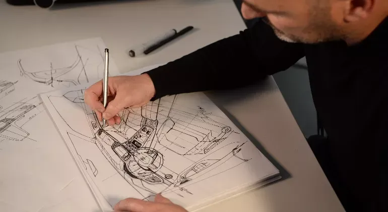
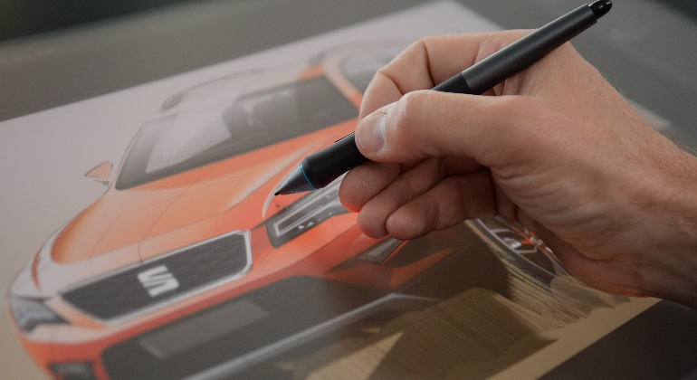
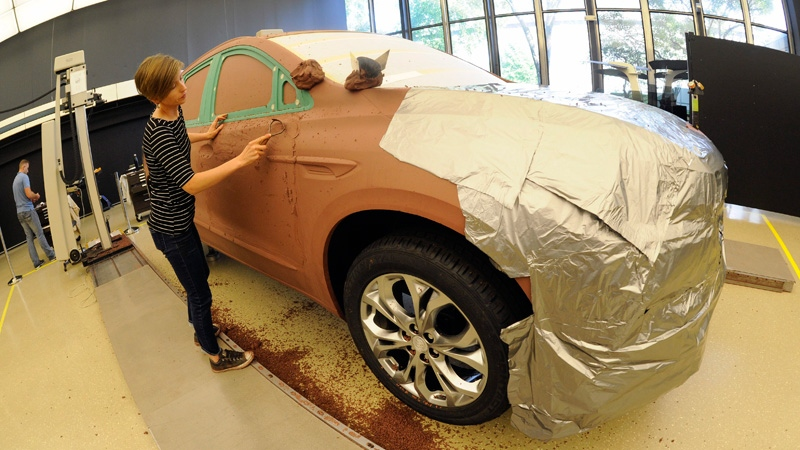
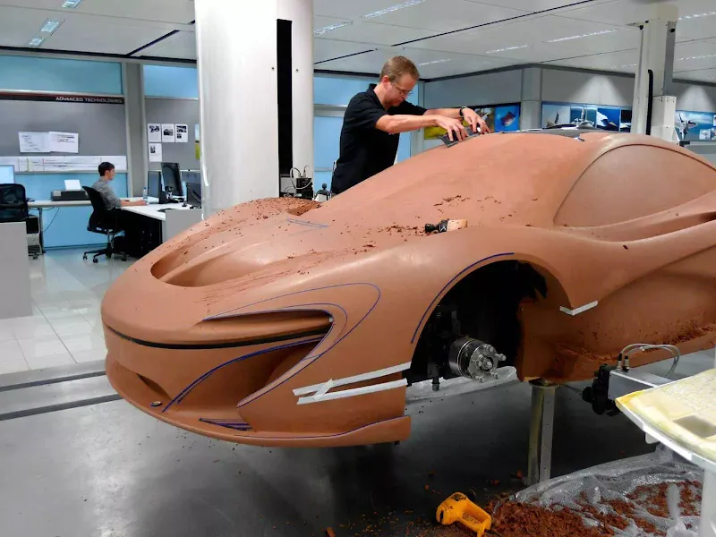
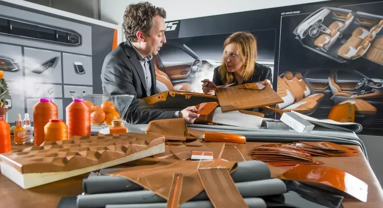
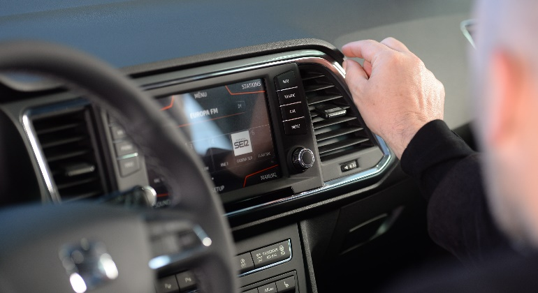

Although it may sometimes seem easy, designing a new model is a task that requires a huge effort from a large team of professionals.  
From the moment pencil is put to paper until the car goes on sale, a series of steps take place, which SEAT reveals to us using its SUV **Ateca** as an example.

{/* more */}

These are the eight essential steps in every design process according to SEAT:

---

## Briefing

The main guidelines of the model are written: the roadmap that will define the car's DNA.  
The entire design process will conform to these guidelines.

*Briefing in car design*

---

## Sketches

Designers put their ideas down by hand: "what we would like to make."  
Over four years, more than **1,000 sketches** can be produced.

*Design sketches*

---

## CAD Generation

The vehicle is virtually recreated using CAD (Computer-Aided Design) software, which allows for 2D and 3D work and technical monitoring.

*CAD design*

---

## Clay Model

A **full-scale clay model** that can weigh more than 4 tons. It is shaped and adjusted manually during development.

*Clay model*

---

## "Frozen Model"

This is the final model approved by the company. Despite still being made of clay, it looks real. Up to **5,000 kg of clay** can be used in total.

*Frozen Model of automotive design*

---

## Color Creation

The Color&Trim department formulates up to 100 colors, although only 12 are approved. They draw inspiration from fashion, architecture, and product design.

*Color creation and selection*

---

## Seats

The seats must be comfortable and aesthetic. Materials and patterns are selected using specialized sewing machines on the prototype.

*Seat production*

---

## Interior Design

Driver-oriented. The central screen defines the rest of the design. Functionality is prioritized: storage space, accessibility, and ergonomics.

*Functional interior design*

---

## Conclusions

Although it may seem like a simple task, designing a car is a process that can take months or years.  
The final result is much more than a vehicle: it is a collective work of design, engineering, and passion for mobility.

**Source:**  
Ingeniería en General  
https://t.me/ingenieriaengeneral
