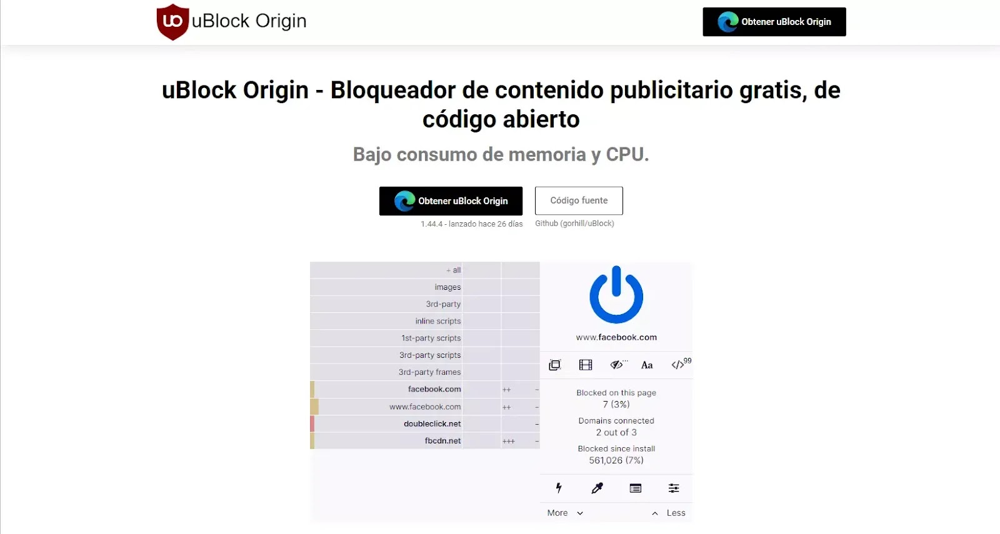
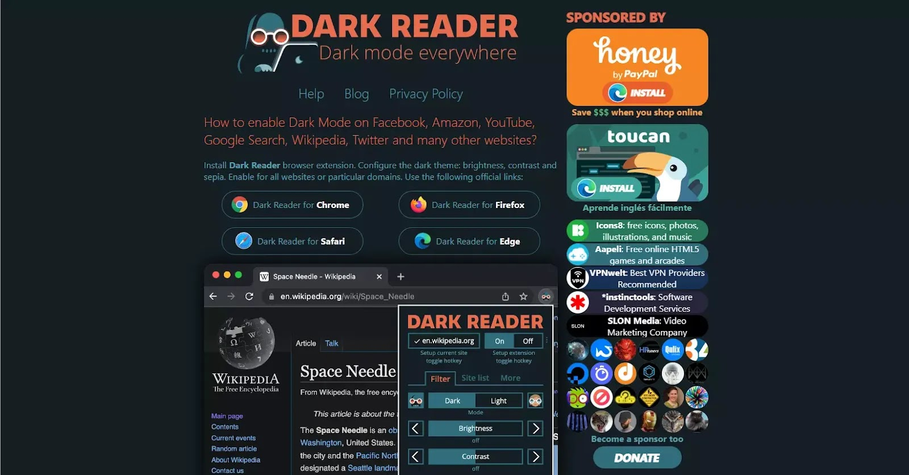
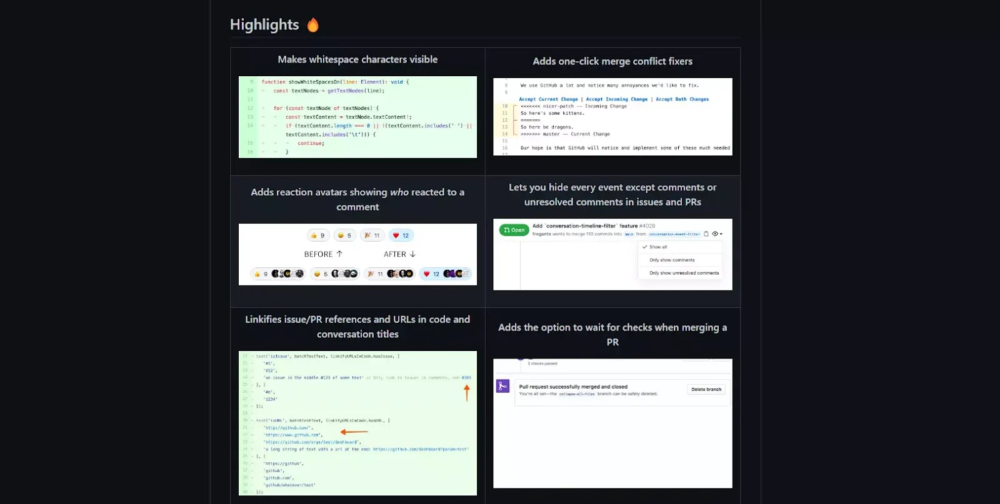

As developers or tech enthusiasts, we want to stay ahead of the curve and stand out. Perhaps you've wished at some point for a tool that makes your work easier or saves you time. That's why today we bring you a list of some extensions that you will undoubtedly love, whether for their great utility or because they add a different aesthetic.

## [uBlock Origin](https://ublockorigin.com/es)

More than once we have felt frustrated from constantly skipping and closing ads here and there, but that ends now. [uBlock Origin](https://ublockorigin.com/es) is an extension that blocks any type of ad on any site you visit, including annoying YouTube ads, while consuming fewer resources than other blockers. So give it a try and you will see the difference.

## [Dark Reader](https://darkreader.org/)

Do you like dark mode? I bet you do. Are you annoyed by sites that don't have a dark mode? I bet you are too. [Dark Reader](https://darkreader.org/) is an extension that modifies web pages to adapt them to a dark mode, changing the background and text color. It is highly useful for those who work at night, thereby reducing eye strain. In addition, you can add a keyboard shortcut to avoid clicking so much.

## [Refined GitHub](https://github.com/refined-github/refined-github)

Undoubtedly, GitHub is the most well-known platform for storing your projects. But did you know that you can add more features to it? Yes, you read that right. With [Refined GitHub](https://github.com/refined-github/refined-github), you can download individual folders or files without having to download the entire repository, as well as revert changes from a commit and access many more functionalities. Become a pro with this extension.

---

> We will add more later.
