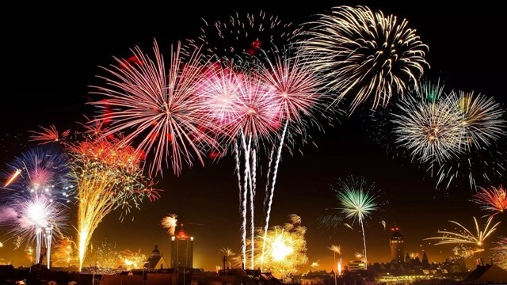
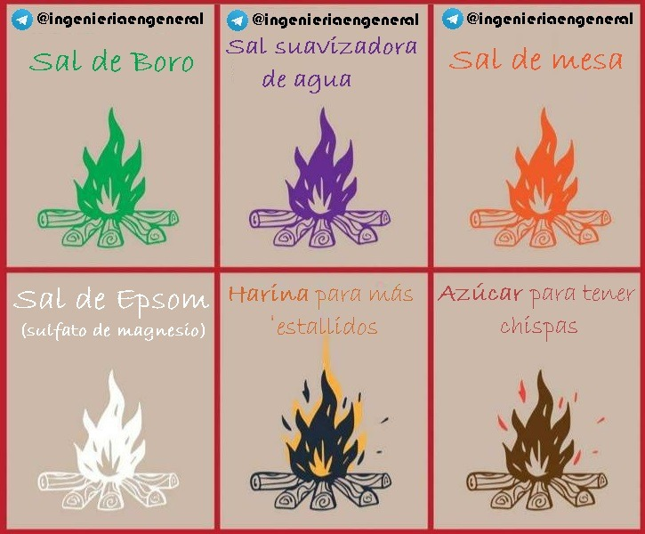

The colors of fireworks are derived from a wide variety of metal salts. And when we say **'salt'**, we obviously do not mean common table salt (sodium chloride), but those compounds that contain metal and non-metal atoms ionically bonded.  
But which chemical elements are responsible for coloring fireworks?

{/* more */}

The most important component of fireworks is, of course, gunpowder. However, the chemical reaction that takes place is not simple, as various elements are involved, along with factors such as humidity, which affects combustion.

Inside fireworks, we find those 'metal powders' that give pyrotechnics their color and spectacularity when they explode.  
When combustion occurs, different metals emit energy at different wavelengths—that is, in different colors.

Here are the most common metal salts used and the colors they produce:

- **Strontium Salts (Sr)**: **RED** color  
  (strontium nitrate, strontium carbonate, strontium sulfate)
- **Calcium Salts (Ca)**: **ORANGE** color  
  (calcium carbonate, calcium chloride, calcium sulfate)
- **Sodium Salts (Na)**: **YELLOW** color  
  (sodium nitrate, sodium oxalate, cryolite)
- **Barium Salts (Ba)**: **GREEN** color  
  (barium nitrate, carbonate, chloride, or chlorate)
- **Copper Salts (Cu)**: **BLUE** color  
  (copper chloride, copper carbonate, copper oxide)
- **Copper + Strontium**: **PURPLE** color
- **Aluminum (Al) and Magnesium (Mg)**: **SILVER** color
- **Magnesium (Mg), Titanium (Ti), or Aluminum (Al)**: **BRIGHT WHITE** color, very common in sparks

Broadly speaking, these are the chemical compounds used to color fireworks.

_Various salts and elements to change the color and behavior of fire_

_Chemical elements to change the color of fire_

---

## Conclusions

Remember to share this post if you find the content we publish valuable and want your friends to become more knowledgeable every day.  
Thank you for reading!

**Source:**  
Ingeniería en General  
https://t.me/ingenieriaengeneral
