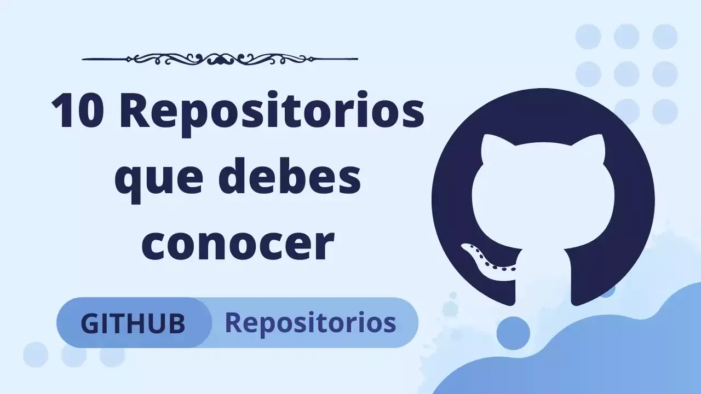

In addition to being the home of some of the most interesting open-source projects on the Internet, GitHub is also an excellent place to share resources of all kinds: free books, APIs, or project ideas. But with such a large amount, it becomes difficult to find the most useful repositories. So I have selected this list of ten fabulous repositories that provide great value for all web and software developers. All of them will add value and help you become a better web or software developer.

## Free Programming Books
**[GitHub🌟: 183K+]** Offered in a variety of different languages, [**Free Programming Books**](https://github.com/EbookFoundation/free-programming-books) is undoubtedly one of the most popular and prominent repositories on GitHub. Although it has "Books" in its name, it offers much more than that. It contains sections for free online courses, interactive programming resources, problem sets and competitive programming, programming games, podcasts, and cheat sheets for almost all programming languages.

---

## Developer Roadmap
**[GitHub🌟: 155K+]** Stuck? Or need some advice to start your journey as a developer? Then [this repository](https://github.com/kamranahmedse/developer-roadmap) will guide you. It has all the technologies you need to know if you want to become a Frontend, Backend, or DevOps Engineer. It has all the technologies to adapt to your needs or convenience.

---

## OSSU Computer Science
**[GitHub🌟:81K+]** If you don't have a background or a degree in computer science and want the knowledge equivalent to a Computer Science degree, then [this repository](https://github.com/ossu/computer-science) is for you. It is for those who want a proper and comprehensive foundation in fundamental concepts for all computing disciplines. It offers all the resources to help you become a self-taught computer science graduate and has a worldwide community of students. It is designed according to the degree requirements of undergraduate computer science majors, minus the general education requirements (non-computer science), since it is assumed that most people following this curriculum already have an education outside the field of computer science. The courses themselves are among the best in the world, often coming from Harvard, Princeton, MIT, etc., but specifically chosen to meet the criteria.

---

## Awesome
**[GitHub🌟: 158K+]** As the name describes, it has an [awesome](https://github.com/sindresorhus/awesome) list of all kinds of interesting topics ranging from computer science to media, from gaming to business, and the list goes on.

---

## Build your own X
**[GitHub🌟: 103K+]** If you are a person who believes in the principle of "learning by doing," then [this repository](https://github.com/danistefanovic/build-your-own-x) has the potential to become your daily stop on GitHub. It has links to resources that help you build your own cryptocurrency, database, bots, BitTorrent clients, and much more.

---

## Coding Interview University
**[Github 🌟: 165K+]** [Coding Interview University](https://github.com/jwasham/coding-interview-university) has a multi-month study plan to become a software engineer for a large tech company like Google, Amazon, Facebook, Apple, or any other software company. It offers advice on how to study to become a reliability engineer or operations engineer. It also has links to flashcards to quickly review your knowledge and stay up to date, originally created by the author of the repository who landed a job at Amazon. And there are many more success stories like that.

---

## Public APIs
**[GitHub🌟: 118K+]** [Public APIs](https://github.com/public-apis/public-apis) has a collective list of all the free APIs available on the Internet to use in your personal or professional projects. It offers a wide range of application programming interfaces (APIs) such as business, anime, animals, news, finance, games, and more.

---

## Tech Interview Handbook
**[GitHub🌟:51K+]** [Tech Interview Handbook](https://github.com/yangshun/tech-interview-handbook) has all the materials you need to crack a technical interview. It has a variety of materials on how to prepare for coding interviews, good questions to ask your interviewer, helpful resume tips, and much more.

---

## System Design Primer
**[GitHub🌟:127K+]** [System Design Primer](https://github.com/donnemartin/system-design-primer) is an excellent repository for software engineers that will help you learn how to design large-scale systems. That will help you become a better engineer. The repository provides an organized collection of resources for this broad topic. Because system design is often a required component of the technical interview process at many companies, this repository can also help you prepare for those interviews with a study guide, tips on how to approach an interview, interview questions with solutions, Anki flashcard decks for interactive learning, and interactive coding challenges.

---

## Design Resources for Developers
**[GitHub🌟:25K+]** [This repository](https://github.com/bradtraversy/design-resources-for-developers) has a curated list of design and UI resources from stock photos, web templates, CSS frameworks, UI libraries, tools, and much more, available for free to use in your projects and applications. It offers all the templates you need to get started with your web development projects.

---

I hope you find these repositories as useful as I do and that you can use them to become a better software engineer. Thanks for reading!
