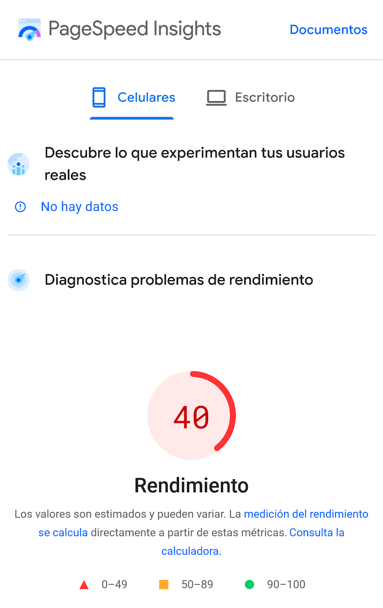
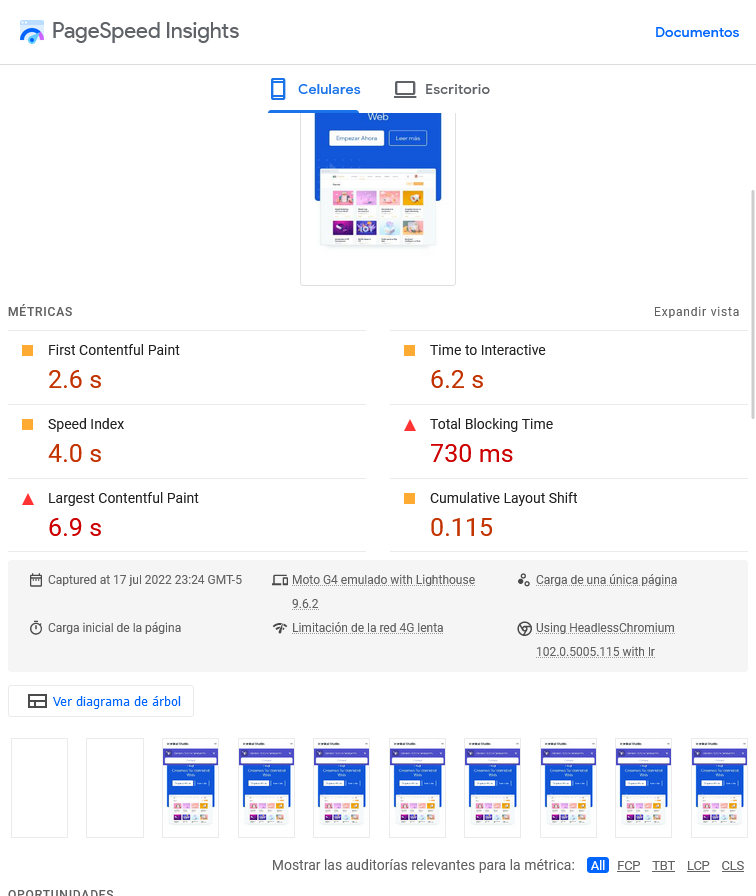
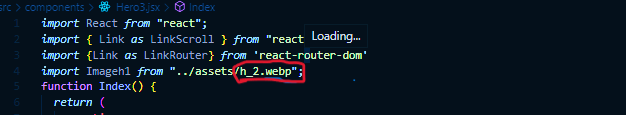
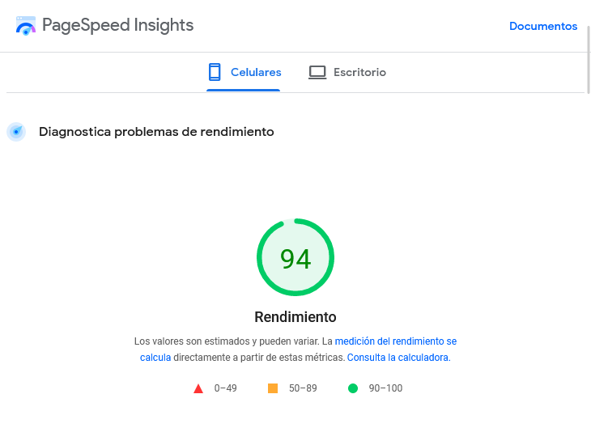

In this article, I will get straight to the point. While browsing the web, I have come across many sites without optimization or with loading issues; some fall within 40% to 70% optimization according to Google. This could be affecting both the user experience and their ranking on the world's largest search engine. That's why I'm sharing this small tutorial, which could help some of you use new tools, reinforce your knowledge, and slightly improve your website's loading speed.

---

## Tools:

### Images in WebP

Created and distributed by Google, **WebP** is an image container format that offers the ability to reduce image file size by up to 60%, in addition to being optimized to work with most web browsers. This will be our first tool.

### Google's PageSpeed Insights

A tool for performance analysis and diagnostics. Designed by Google, **PageSpeed Insights** offers a free analysis of your website's performance. This will be our second tool.

---

## Let's get started

First, we need to know what issues our website has regarding **performance**. To do this, we will visit the official website of **[PageSpeed](https://pagespeed.web.dev/)** and enter our site's URL.

In this case, we see low performance. Visiting the site organically, we notice it is an app built with **React**, and despite getting a low percentage in this analysis, the load time averages between 1 and 2 seconds. Let's see what is failing.

As we scroll down, we read a detailed list of errors and possible solutions. Among them, we find that some images are in **jpg** and **png** format.

---

## Solution:

### Step 1

We need to convert our png files to webp. We visit the following URL: **[convertio.co](https://convertio.co/)**, where we will be shown a panel where we can add and convert our files to webp.

### Step 2

Replace these files in our project.

### Step 3

Add **lazy loading** to the images. In HTML, this is as simple as adding the `loading="lazy"` attribute inside our img tag, like this:

Now we will perform a second analysis to see the result.

Since it is a **React** website, we can see that a minor change in image formats and a bit of **lazy loading** when rendering the **DOM** helped us improve performance and load metrics. This improves Google's view of our site, making it a better candidate for **SEO** ranking. You may experience a noticeable improvement on your site, though perhaps not as dramatic as this one.

In addition to the above, here are some tips to improve website performance:

- Use appropriate image sizes for mobile devices.
- Always use best practices when coding.
- Using libraries like **Bootstrap** or **Tailwind** can affect loading times if the code is not properly cleaned/purged.
- Enable cache acceleration through your **Hosting** provider.

---

## Conclusion:

Improving your website's performance will help create better interaction and a smooth user experience.

with 💜 s3ntin3l
Buy me a **[coffee](https://www.buymeacoffee.com/sentinelbot)** ☕
