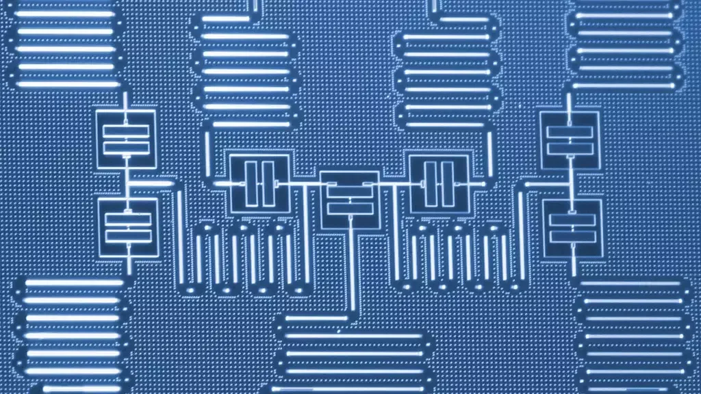

> Unlike classical bits, qubits can be in multiple states at once, drastically increasing processing capacity.
> Although promising for solving complex problems in various fields, it faces significant challenges in its development and programming.
---

**Quantum computing** is a branch of computer science that focuses on the study of how to use quantum systems to process information.
These systems utilize quantum phenomena, such as **superposition** and **entanglement**, to perform calculations that are not possible with traditional technology.

Unlike classical computing, which uses bits that can only have values of 0 or 1, quantum computing uses **qubits**, which can be in a state of superposition of 0 and 1 at the same time.  
This allows quantum computing to perform operations much more efficiently than classical computing, making it ideal for solving complex problems that require a vast number of calculations.

However, managing qubits is a challenge, as they are highly sensitive to their environment and can easily lose their coherent quantum state.

Another important aspect of qubits is their capacity for **entanglement**. Quantum entanglement allows two or more qubits to exist in a correlated state, enabling them to perform operations much faster and more accurately than if each qubit were treated individually.

One of the main challenges of quantum computing is that quantum systems are extremely sensitive to external disturbances.  
This makes it difficult to build and maintain reliable quantum devices.  
Additionally, programming for quantum systems is a completely new field, requiring new programming languages and algorithms to use this technology efficiently.

Despite these challenges, quantum computing has great potential.  
In the future, it is expected to be used to solve problems in fields such as cryptography, the simulation of complex systems, and finding patterns in large datasets.  
It is also believed that it can be used to develop new types of sensors and medical devices.

---

In summary, quantum computing is an emerging and promising field that has the potential to revolutionize information technology.  
Qubits are a fundamental piece of this technology, and their capacity for superposition and entanglement allows them to perform operations much more efficiently than classical computing.  

As technology advances and new techniques are developed to manage qubits more efficiently, quantum computing has the potential to change the way calculations and operations are performed in the digital world.  
Although it is still in the development phase, it is expected that in the near future it can be used to solve problems that are currently too complex to be solved with traditional technology.
