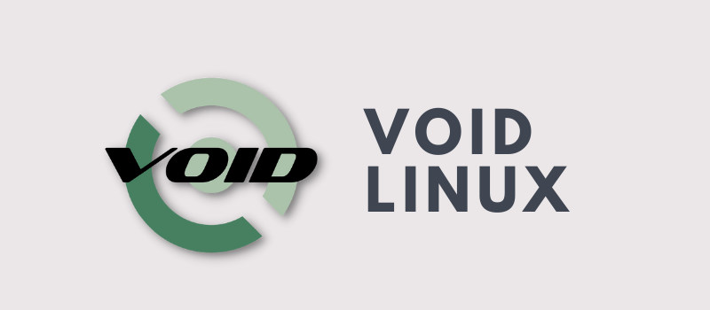

There are so many Linux distributions that they can be divided into different categories based on their features, enhancements, intended target audience, and more. In this article, we will show you some of the best rolling release Linux distributions.

***Do you know what a "rolling release" distribution is?***  
These distributions do not wait six months or more to release a new version with new versions of the Linux kernel, desktop environment, or other major software components. Instead, they are updated shortly after new software is released.

Now that you are aware of that, let's take a look at some of the best rolling release Linux distributions.

## [openSUSE Tumbleweed](https://www.opensuse.org/)

Good old openSUSE focused on stability for years with its point-release system. A few years ago, they decided to split their offering by creating openSUSE Leap and Tumbleweed.  
While openSUSE Leap follows a point release with a new version every few years, Tumbleweed releases new software shortly after it comes out.

openSUSE Tumbleweed is an excellent choice for those who want to stay on the RPM side (Red Hat side). The openSUSE ecosystem is much more diverse, with a massive software repository. Additionally, Zypper and YaST provide you with many options for package management.

## [Arch Linux](https://archlinux.org/)

It is the most popular rolling release distribution. It is almost synonymous with rolling release.  
There are many reasons why Arch Linux has a cult status among Linux users. I think it has more to do with the sense of accomplishment one feels after installing Arch Linux, because even the installation procedure is not like other distributions.

Arch has a good amount of software officially available in its repositories. And then the Arch User Repository (AUR) makes almost any other Linux software available through community efforts.

## [Manjaro Linux](https://manjaro.org/)

Manjaro is basically Arch without all the hassle that comes with Arch Linux.  
It is based on Arch Linux, so you get Pacman and AUR with a rolling release model. At the same time, Manjaro has a graphical installer, a GUI-based package manager, and other graphical tools to enhance your experience.

Manjaro is easier to install and easier to use. A good choice for those who want to stay comfortably in the Arch domain.  
**Note:** There are many other good distributions based on Arch Linux that I couldn't include in this list. If you wish, you can try **Garuda Linux**, **EndeavourOS**, and many others.

## [Solus Linux](https://getsol.us/)

Solus is also a "curated" rolling release distribution. Unlike Manjaro, it is not based on Arch. It is built from scratch and uses a package manager called: **eopkg**.

Solus is a good option if you want something different but not complicated enough to make you feel uncomfortable.

## [Debian Testing](https://www.debian.org/devel/testing)

Debian is known for its focus on stability, so much so that stability sometimes equates to outdated software. But that's for the stable branch.

Debian Testing sits somewhere between the stable and unstable branches. It gets new features before they make it into the stable release.

## [Void Linux](https://voidlinux.org/)

Void was also built from scratch, meaning it is not based on Arch, Red Hat, or Debian.  
It is a rolling release, but not bleeding-edge like Arch. It prioritizes stability.

Another thing that separates it from other distributions is its use of **runit** as the init system. All in all, Void is a good option if you are an experienced Linux user.

## [Gentoo Linux](https://www.gentoo.org/)

Gentoo is not like grabbing a cup of coffee and waiting for everything to install easily. Everything from installation to configuration and package management requires experience and time.

Gentoo might be the distribution of choice if you feel that any other distribution is not challenging enough.

## Conclusions

Whatever your experience level, there will always be a distro that suits you. From Tumbleweed to Gentoo, from the easiest to the most complex, in the Linux world you will find crazy and interesting things. Try testing them or check the forums, and you will surely find something to stick with.
