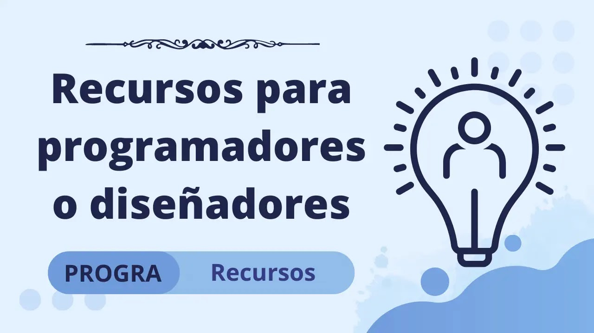
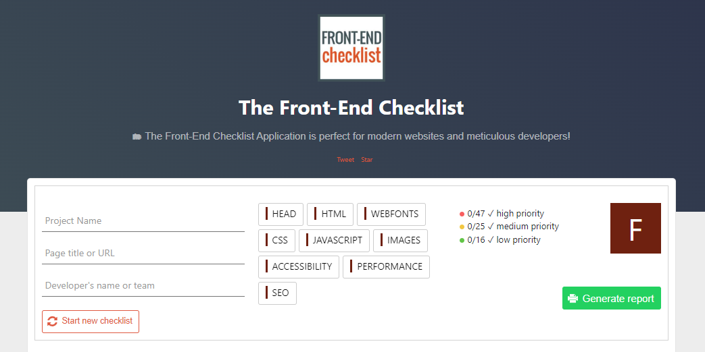
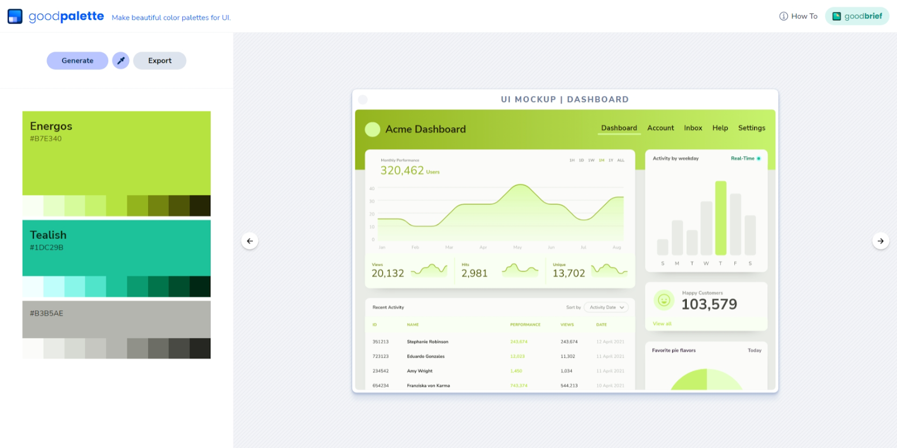
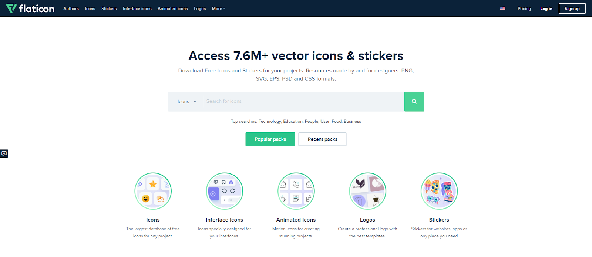

Whether you need tools to make your tasks as a programmer easier or inspiration for a new design in mind, streamlining the process is something we all need. The reasons? Improving delivery times, leaving work early, among other benefits. Check out this list we have prepared for you.

##### Listen to lo-fi music while reading this article

  

    

      <svg viewBox="0 0 213.7 213.7">
        <polygon class="t" points="73.5,62.5 148.5,105.8 73.5,149.1"></polygon>
        <circle class="c" cx="106.8" cy="106.8" r="103.3"></circle>
      </svg>
    

  

---

## [The Front-End Checklist](https://frontendchecklist.io/)

If what you want in this life is to become a web developer, this website gathers all the phases and technologies you should learn to create amazing websites.

[Go to site](https://frontendchecklist.io/)

---

## [Web Skills](https://andreasbm.github.io/web-skills/)

Web Skills is a visual overview of useful skills to learn as a web developer. It is helpful for people who have just started learning web development, as well as for people who have been in the field for years and want to learn new things.

[Go to site](https://andreasbm.github.io/web-skills/)

---

  
Related Articles
  
  

---

## [Goodpalette](https://goodpalette.io/)

Using too many colors is often distracting. Limiting your color palette to a primary color, an accent color, and a solid base of neutral tones can help make your design feel consistent.

Goodpalette provides you with exactly that. Each color has nine shades that have been carefully selected to be used for text, backgrounds, wells, buttons, and more. You can also see how the color will look on different types of websites with live mockups. It's one thing to look at a selection of color swatches in isolation, but seeing it in the context of a real application is key.

[Go to site](https://goodpalette.io/)

---

## [Flaticon](https://www.flaticon.com/)

Need icons for your website, an assignment, or a project? Flaticon is your solution, featuring millions of icons available for download in PNG, SVG, EPS, PSD, and CSS formats, at the best possible resolution!

[Go to site](https://www.flaticon.com/)

---

We will be adding more sources soon!
